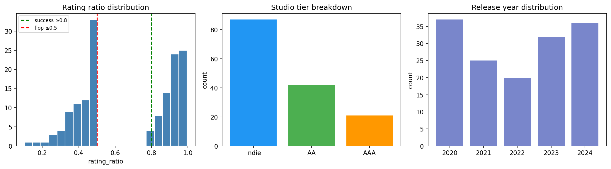
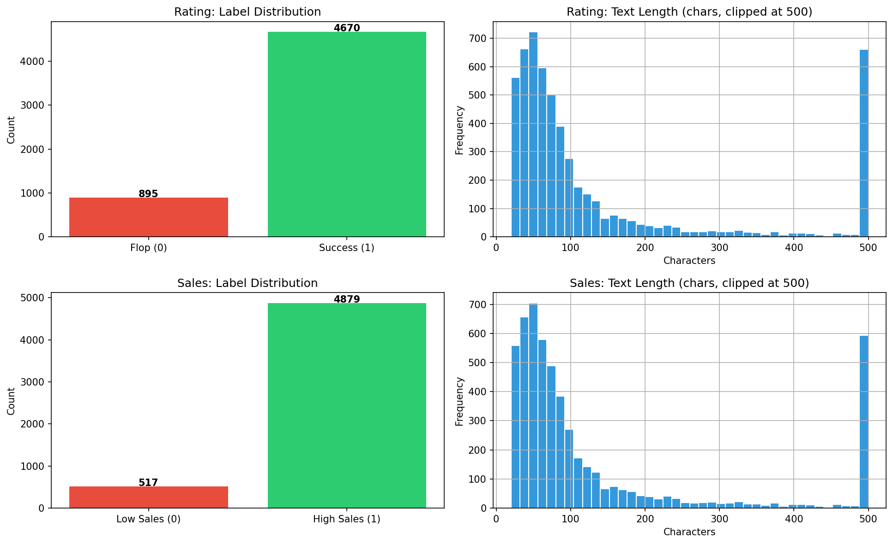
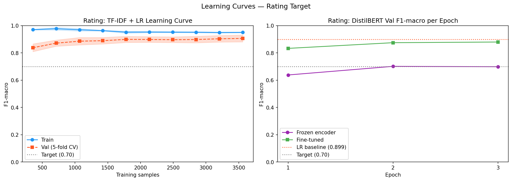
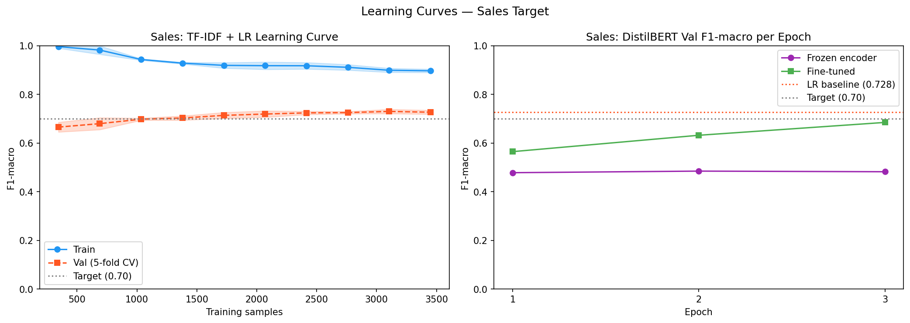
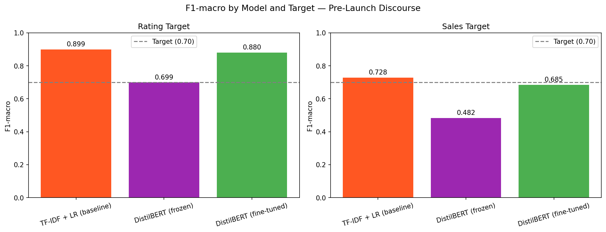

# Prevendo o Sucesso Comercial de Videogames a partir de Texto Pré-Lançamento

**Track:** Deep Learning Researcher  
**Dataset:** FronkonGames/steam-games-dataset (HuggingFace, CC-BY-4.0)  
**Código:** `notebooks/02_nlp_pipeline_colab_executed.ipynb`

---

## 1. Introdução

### 1.1 Motivação

O destino comercial de um videogame frequentemente se antecipa meses antes do lançamento, não em números de pré-venda ou métricas de marketing, mas no conteúdo do que a comunidade está dizendo. Os casos abaixo ilustram que o discurso pré-lançamento carrega um sinal preditivo real.

**Concord (2024).** Desenvolvido por oito anos pela Firewalk Studios com orçamento estimado acima de 200 milhões de dólares, o hero shooter da PlayStation estreou em 23 de agosto de 2024 com um pico de aproximadamente 700 jogadores simultâneos no Steam. O jogo foi retirado do ar em 6 de setembro de 2024, catorze dias após o lançamento. As semanas anteriores ao lançamento já acumulavam críticas no Reddit e YouTube sobre identidade visual genérica, mecânicas derivativas e um modelo de negócios considerado deslocado do contexto atual do mercado.

**Skull and Bones (2024).** Após onze anos de desenvolvimento e múltiplos adiamentos, o jogo da Ubisoft foi lançado em fevereiro de 2024 com o título oficioso de "AAAA" atribuído pelo próprio CEO da empresa. A comunidade havia acompanhado cada adiamento com ceticismo crescente, e os comentários pré-lançamento em subreddits de jogos da Ubisoft antecipavam as avaliações medianas que o jogo acabou recebendo.

**Highguard (2026).** Revelado como a "última novidade" do The Game Awards 2025, o slot mais aguardado da premiação (a audiência esperava um anúncio de grande impacto como um novo Titanfall), o hero shooter fantasy da Wildlight Entertainment foi recebido com hostilidade imediata. O trailer oficial acumulou uma proporção de dez dislikes para cada like. O jogo lançou em 26 de janeiro de 2026, atingiu um pico de 97.000 jogadores simultâneos no Steam no primeiro dia e caiu para 1.600 jogadores em meados de fevereiro, queda de mais de 98%. A Tencent retirou o financiamento pouco após o lançamento. Em 3 de março de 2026, a Wildlight anunciou o encerramento permanente dos servidores para 12 de março, 45 dias após o lançamento.[1][2]

**Marathon (2026).** O caso mais recente, mais documentado e o mais complexo. O novo jogo da Bungie é um extraction shooter sci-fi que chegou ao lançamento em 5 de março de 2026 carregando um histórico de turbulências: do pico de 1.600 funcionários em meados de 2023, a Bungie chegou ao final de 2024 com cerca de 850, redução de 47% em um ano, incluindo demissão de 220 pessoas em julho de 2024 e transferência de outras 155 para a Sony.[3] O diretor do jogo, Chris Barrett, foi demitido por denúncias de assédio sexual e processou a Sony em seguida. Em 2025, uma artista acusou publicamente a Bungie de usar seu trabalho sem permissão em materiais do jogo, plágio confirmado pela empresa, o que levou a um adiamento do lançamento.[4]

O ambiente em que o jogo estreou já era hostil antes mesmo do primeiro trailer. A comunidade de Destiny 2, maior franquia da Bungie, não queria um extraction shooter: queria um Destiny 3. Ao perceber que a Bungie havia direcionado seus recursos para um novo IP em vez de continuar a franquia, parte da base de jogadores canalizou a frustração diretamente para o Marathon, interpretando o jogo como o responsável pelo abandono do Destiny. Somado a isso, o gênero extraction shooter é nichado e competitivo, com jogadores fiéis a títulos já estabelecidos.

O resultado nos primeiros meses de vida do jogo reflete essa conjuntura:

| Período | Pico de jogadores simultâneos | Variação em relação ao lançamento |
|---|---|---|
| 06/03/2026 (lançamento) | 88.337 | referência |
| ~13/03/2026 (1 semana) | ~13.000 | −85% |
| Maio 2026 (pico mensal) | 17.042 | −81% |

*Fonte: [steamcharts.com/app/3065800](https://steamcharts.com/app/3065800) [6]*

No campo financeiro, a Sony registrou um impairment loss de **765 milhões de dólares** sobre a aquisição da Bungie em seu ano fiscal 2025, mais de 21% dos 3,6 bilhões pagos em 2022. A baixa veio em dois momentos: 200 milhões no segundo trimestre, por subadesempenho do Destiny 2, e 565 milhões no quarto trimestre encerrado em março de 2026, com o Marathon aquém das expectativas de lançamento.[7]

O capítulo mais recente veio depois do lançamento: ao confirmar que Destiny 2 receberia sua última atualização de conteúdo em 9 de junho de 2026, a Bungie desencadeou uma nova onda de review bombing no Steam, com avaliações declarando "Destiny morreu por um extraction shooter mediano" postadas em massa por jogadores que sequer compraram o Marathon.[5]

O que diferencia o Marathon dos outros casos desta seção é que, apesar de todo o contexto adverso, **o jogo está vivo**. A equipe de desenvolvedores trabalha com planejamento de longo prazo, a Bungie segue com o apoio da Sony, e a base de jogadores, embora menor que o esperado no lançamento, se mantém ativa. O Marathon é o ponto fora da curva: um jogo que acumulou hate pré-lançamento mensurável, sofreu queda acentuada nas primeiras semanas, mas não seguiu o mesmo caminho de Concord e Highguard. Isso ilustra um ponto relevante para este projeto: o discurso pré-lançamento é um sinal preditivo, mas não determinístico. Fatores como qualidade do produto, suporte do publisher e fidelidade de nicho também determinam o destino de um jogo, e esses fatores não são capturáveis apenas pelo texto.

Nos casos de Concord, Skull and Bones e Highguard, o sinal estava no texto antes do jogo sair: buzz negativo, comparações com fracassos anteriores e críticas ao modelo de negócios estavam acessíveis no Reddit e YouTube semanas ou meses antes do lançamento, e o destino comercial confirmou o que a comunidade já dizia. O Marathon adiciona uma camada de complexidade a essa hipótese: o sinal pré-lançamento existia e era intenso, mas o jogo sobreviveu. Essa distinção, entre sinal e determinismo, é parte do que este projeto busca explorar empiricamente.

**Fontes da motivação:**
> [1] Newsweek. *The Game Awards 2025 darling 'Highguard' shuts down permanently next week.* https://www.newsweek.com/entertainment/the-game-awards-2025-darling-highguard-shuts-down-permanently-next-week-11614975  
> [2] VideoCardz. *Highguard launched January 26, shuts down March 12.* https://videocardz.com/newz/highguard-launched-january-26-shuts-down-march-12  
> [3] Udonis. *Bungie Layoffs 2026: 50% Workforce Reduction.* https://www.blog.udonis.co/mobile-marketing/mobile-games/bungie-layoffs  
> [4] Dexerto. *Marathon delayed indefinitely after plagiarism controversy.* https://www.dexerto.com/gaming/marathon-delayed-indefinitely-after-plagiarism-controversy-player-feedback-3215979/  
> [5] Dexerto. *Marathon review bombed by Destiny 2 fans as Bungie ends development.* https://www.dexerto.com/gaming/marathon-review-bombed-by-destiny-2-fans-as-bungie-ends-development-3367101/  
> [6] Steam Charts. *Marathon.* https://steamcharts.com/app/3065800  
> [7] PC Gamer. *Sony records a $766 million impairment loss against Bungie for the 2025 financial year.* https://www.pcgamer.com/gaming-industry/sony-records-a-usd766-million-impairment-loss-against-bungie-for-the-2025-financial-year-a-1-2-punch-of-destiny-2-and-marathon-failing-to-meet-its-expectations/

### 1.2 Problema e objetivo

Este projeto investiga se um classificador binário treinado **exclusivamente em texto pré-lançamento** consegue prever se um videogame será bem avaliado e bem-vendido. A restrição temporal é central: todos os textos de treinamento e teste têm data anterior ao lançamento do jogo na Steam, eliminando qualquer possibilidade de data leakage.

**Objetivo mensurável:** F1-macro ≥ 0,70 nos dois targets de classificação (avaliação e vendas) usando textos coletados nos 90 dias anteriores ao lançamento.

---

## 2. Revisão de Literatura

A literatura relevante divide-se em três fluxos, nenhum dos quais cobre a combinação exata deste projeto.

### 2.1 Predição pré-lançamento por texto (domínio de filmes)

Asur & Huberman (2010) mostraram que a taxa de tweets nas duas semanas anteriores ao lançamento de um filme prediz a bilheteria de estreia com Pearson r = 0,97, superando o Hollywood Stock Exchange. Esse é o resultado fundacional que demonstra que texto social pré-lançamento carrega sinal preditivo. Mestyan, Yasseri & Kertész (2013) estenderam essa abordagem combinando atividade de edição na Wikipedia com contagem de comentários de trailers no YouTube (312 filmes, R² = 0,68), mostrando que comentários de trailers são especificamente um sinal mensurável de desempenho comercial com até um mês de antecedência. Dois trabalhos mais recentes aplicam TF-IDF e classificadores clássicos a comentários pré-lançamento para classificação binária de sucesso de filmes: um artigo da IEEE (2020) reporta SVM+TF-IDF com 81% de accuracy, e um capítulo da Springer (2023) reporta Random Forest com 78% de accuracy, identificando que negatividade acelerada nas duas semanas finais é o preditor mais forte de fracasso.

Esses quatro trabalhos validam a metodologia para o domínio de filmes. Nenhum se estende a videogames, e nenhum usa o Reddit, plataforma onde comunidades de jogos produzem discussões sustentadas ao longo de meses com densidade de informação muito superior à do Twitter.

### 2.2 NLP em texto de jogos (pós-lançamento)

O trabalho mais próximo em domínio usa reviews do Steam escritas após o lançamento. Um artigo de 2023 aplica BERT fine-tuned e BiLSTM+CRF a reviews do Steam (GTA V, Cyberpunk 2077) e reporta BERT F1 = 88,0%, superando TF-IDF+SVM com 82%, estabelecendo que BERT supera TF-IDF em texto de jogos quando as reviews são longas e descritivas. O trabalho mais recente comparável (ACM AICC, 2025) treina um classificador fine-tuned sobre aproximadamente 100 mil reviews pós-lançamento e reporta 76% de accuracy contra 68% do baseline TF-IDF+LR. Abdul-Rahman et al. (2024, Springer) usam análise de sentimento de reviews Steam para prever churn de jogadores com enquadramento similar.

Todos esses trabalhos operam com texto pós-lançamento. O modelo não pode ser executado antes do jogo sair e está sujeito a data leakage por design, pois o rótulo de sucesso ou fracasso já é observável no momento em que as reviews são escritas.

### 2.3 Predição de sucesso de jogos sem NLP

De Luisa et al. (2021) e Ullmann et al. (2021/2022) predizem popularidade e avaliações de jogos usando metadata estruturada (tamanho do time, gênero, plataforma, publisher), encontrando que time pequeno e presença online antecipada correlacionam com avaliações mais altas no Metacritic, mas sem incorporar conteúdo textual. IJITCS (2025) adiciona contagens de engagement em redes sociais (número de upvotes no Reddit, contagem de tweets) ao XGBoost e melhora +6 p.p. em relação ao modelo metadata-only, mas trata o Reddit como sinal de volume, não como fonte de texto semântico. Wiley (2025) confirma padrões similares em análise cross-platform com dados estruturados.

### 2.4 Lacuna identificada

Nenhum trabalho publicado combina: **(a)** apenas texto pré-lançamento, **(b)** posts do Reddit e comentários de trailers do YouTube simultaneamente, **(c)** para classificação binária de sucesso de videogames, **(d)** comparando TF-IDF+LR contra DistilBERT frozen e fine-tuned com F1-macro como métrica principal. A lacuna é tripla: **fonte** (Reddit + YouTube vs. Twitter/Wikipedia), **domínio** (jogos vs. filmes) e **restrição temporal** (pré-lançamento estrito vs. pós-lançamento). A literatura de predição pré-lançamento para filmes cobre a restrição temporal mas não o domínio nem o Reddit. A literatura de NLP para jogos cobre o domínio mas não a restrição temporal.

---

## 3. Dataset

### 3.1 Seleção dos jogos

145 jogos foram selecionados do `FronkonGames/steam-games-dataset` (HuggingFace, ~124k jogos, CC-BY-4.0) por amostragem estratificada na janela 2020–2024. A estratificação garante diversidade por tier de estúdio e resultado comercial, produzindo 73 sucessos e 72 fracassos por avaliação, distribuídos entre indie (83 jogos), AA (41) e AAA (21). A lista completa está disponível em [`data/raw/games.csv`](../data/raw/games.csv).

**Definição dos targets:**

- **Avaliação (`label_rating`):** `rating_ratio = positive / (positive + negative) ≥ 0,80` → sucesso (1); `≤ 0,50` → fracasso (0). A faixa intermediária é excluída para reduzir ruído nos rótulos.
- **Vendas (`label_sales`):** `estimated_owners_mid ≥ 150.000` → alto (1); abaixo → baixo (0). Jogos gratuitos (`price == 0`) são excluídos por terem distribuição de donos estruturalmente diferente dos títulos pagos. O limiar é a mediana da amostra.

O rótulo de avaliação é balanceado por design (73/72). O de vendas é desbalanceado: 93 alto / 41 baixo (~70/30), refletindo que a maioria dos títulos pagos indie na janela 2020–2024 ultrapassa 150 mil donos estimados.

### 3.2 Limitações na obtenção de dados de vendas

Obter dados confiáveis de vendas de videogames é uma das maiores dificuldades do domínio. A Valve não publica números de vendas da Steam, de modo que qualquer estimativa depende de inferências indiretas, como as realizadas pelo SteamSpy, que extrapolam contagens de donos a partir de amostras de perfis públicos. O dataset HuggingFace utilizado neste projeto herda esse problema: a coluna `estimated_owners` é uma faixa (por exemplo, "200000–500000"), não um número exato.

Mais relevante ainda é a ausência completa de dados de console. Muitos jogos que fracassaram ou tiveram sucesso o fizeram primariamente em PlayStation, Xbox ou Nintendo Switch, plataformas cujas empresas não publicam dados de vendas por título. Jogos como Concord, Highguard e os exemplos da motivação são lançados multi-plataforma, mas apenas a parcela Steam fica observável. Isso significa que o target de vendas deste projeto captura desempenho na Steam especificamente, não o desempenho comercial global do jogo. Para títulos AAA com forte presença em console, essa diferença pode ser substancial: um jogo que fracassou na Steam pode ter vendido moderadamente bem no PS5, e vice-versa. Essa limitação é estrutural do campo e não pode ser contornada com coleta adicional de dados públicos.

### 3.3 Coleta de textos

Todos os textos foram coletados com `release_date` como cutoff: apenas posts e comentários com `days_before_launch > 0` foram retidos, garantindo a restrição de não-leakage.

- **Reddit:** API PullPush.io (sem autenticação), janela de 90 dias. 4.709 posts de 98 dos 145 jogos. 47 jogos (majoritariamente títulos indie com presença mínima online) não geraram dados no Reddit.
- **YouTube:** YouTube Data API v3, vídeos de trailer e teaser publicados antes do lançamento de cada jogo, todos os comentários pré-lançamento. 27.864 comentários de 32 jogos. A cobertura concentra-se em títulos AAA com canal oficial ativo.

Total: **32.573 textos** entre as duas plataformas.

A cobertura desigual entre plataformas é uma limitação real: títulos indie têm poucos ou nenhum comentário no YouTube e geralmente menos posts no Reddit. 47 dos 145 jogos não geraram nenhum dado e foram excluídos dos datasets processados.

### 3.4 Datasets processados

Após filtro de idioma (inglês via `langdetect`), deduplicação e join com os rótulos por jogo, quatro datasets foram gerados:

| Dataset | Linhas | Jogos |
|---|---|---|
| `dataset_rating_granular` | 5.565 | 104 |
| `dataset_sales_granular` | 5.396 | 99 |
| `dataset_rating_aggregated` | 104 | 104 |
| `dataset_sales_aggregated` | 99 | 99 |

Os datasets granulares atribuem a cada texto o rótulo do jogo correspondente (1 texto = 1 linha). Os agregados concatenam todos os textos por jogo em um único documento (1 jogo = 1 linha). O pipeline NLP usa a forma granular; a agregada é fornecida para trabalho futuro.

---

## 4. Métodos

Todos os modelos são treinados nos datasets granulares com divisão 80/20 estratificada por rótulo. O conjunto de teste é separado antes de qualquer treinamento e nunca é usado para seleção de hiperparâmetros.

### 4.1 Baseline: TF-IDF + Regressão Logística

`TfidfVectorizer` (máximo de 10.000 features, bigramas) encadeado com `LogisticRegression` via sklearn `Pipeline`. Desbalanceamento tratado com `class_weight='balanced'`. Sem ajuste de hiperparâmetros além dos defaults, espelhando o baseline do curso (`03-case_study_sentiment.ipynb`).

### 4.2 DistilBERT Frozen

`distilbert-base-uncased` com todos os pesos do transformer congelados. Apenas a cabeça de classificação (`nn.Linear(768, 2)`) é treinada. Essa configuração isola se as representações pré-treinadas do BERT já são úteis para esse domínio sem nenhuma adaptação.

### 4.3 DistilBERT Fine-tuned

Mesma arquitetura, todos os pesos descongelados. Treinado de ponta a ponta com `AdamW` (lr=1e-5) por 3 épocas. A taxa de aprendizado baixa evita catastrophic forgetting dos pesos pré-treinados, seguindo o protocolo do notebook `07-finetuning_bert.ipynb`. Cross-entropy ponderada espelha o tratamento de `class_weight='balanced'` aplicado ao baseline.

Ambas as variantes BERT usam comprimento máximo de sequência 128, batch size 32, treinados no Google Colab com GPU T4 (aproximadamente 30 minutos por target).

### 4.4 Avaliação

Métrica principal: **F1-macro** (média não-ponderada do F1 por classe). Essa métrica é padrão nos trabalhos relacionados para classificação binária desbalanceada e penaliza modelos que ignoram a classe minoritária. Métricas secundárias (precisão, recall, acurácia) são reportadas nos relatórios de classificação completos no notebook.

---

## 5. Resultados

### 5.1 Target de avaliação (`label_rating`)

Conjunto de teste: 1.113 amostras (179 fracasso / 934 sucesso).

| Modelo | F1-macro |
|---|---|
| TF-IDF + LR (baseline) | **0,8989** |
| DistilBERT frozen | 0,6987 |
| DistilBERT fine-tuned | 0,8801 |

Os três modelos superam a meta de F1-macro ≥ 0,70. O baseline supera ambas as variantes BERT.

### 5.2 Target de vendas (`label_sales`)

Conjunto de teste: 1.080 amostras (103 baixo / 977 alto).

| Modelo | F1-macro |
|---|---|
| TF-IDF + LR (baseline) | **0,7280** |
| DistilBERT frozen | 0,4822 |
| DistilBERT fine-tuned | 0,6850 |

TF-IDF+LR supera a meta; DistilBERT fine-tuned fica em 0,685, ligeiramente abaixo; DistilBERT frozen colapsa para desempenho próximo ao acaso.

### 5.3 Curvas de aprendizado

### 5.4 Comparação consolidada

---

## 6. Discussão

### 6.1 Por que TF-IDF supera DistilBERT no target de avaliação

O resultado contradiz o padrão da literatura de reviews pós-lançamento, onde BERT fine-tuned (F1 = 88%) supera consistentemente TF-IDF+SVM (F1 = 82%) em texto de jogos. Neste projeto a relação se inverte: TF-IDF 0,899 > DistilBERT fine-tuned 0,880 no target de avaliação.

Uma explicação plausível está na distribuição do input. Posts pré-lançamento do Reddit e comentários de trailer do YouTube têm mediana de aproximadamente 73 caracteres, frases curtas e densas em palavras-chave como "this looks terrible", "day one buy", "another live-service disaster". Os mecanismos de atenção dos transformers são projetados para capturar dependências de longa distância entre centenas de tokens; em entradas de uma única frase eles oferecem pouca vantagem sobre bag-of-words, que captura diretamente as palavras discriminativas. Reviews do Steam são mais longas e discursivas, dando às representações contextuais do BERT mais estrutura para trabalhar. A lição é metodológica: a superioridade do deep learning sobre bag-of-words não é incondicional, dependendo do comprimento e da natureza do texto.

### 6.2 Por que vendas é mais difícil

O target de vendas é estruturalmente mais difícil por três razões. Primeiro, o desbalanceamento é mais severo (aproximadamente 90% alto / 10% baixo no conjunto de teste), deixando menos exemplos da classe minoritária para aprender. Segundo, vendas comerciais são determinadas por gastos de marketing, visibilidade na plataforma e pré-vendas, fatores parcialmente refletidos no discurso mas também por decisões de negócio que não deixam rastro textual. Terceiro, como discutido na seção 3.2, o target captura apenas desempenho na Steam, e muitos títulos com forte presença em console têm sua performance majoritária fora da plataforma.

O colapso do DistilBERT frozen a 0,482 no target de vendas demonstra que as representações pré-treinadas do BERT, sem adaptação ao discurso pré-lançamento de jogos, não têm capacidade intrínseca de separar jogos de alta venda dos de baixa. A variante fine-tuned se recupera para 0,685, mostrando que a adaptação de domínio é necessária, mas o desbalanceamento 90/10 ainda limita o recall da classe minoritária.

### 6.3 Comparação com a literatura

| Trabalho | Método | Domínio | Dados | Métrica | Score |
|---|---|---|---|---|---|
| Asur & Huberman 2010 | Tweet rate + sentimento | Filmes | Pré-lançamento | Pearson r | 0,97 |
| IEEE YouTube 2020 | TF-IDF + SVM | Filmes | Trailers pré-lançamento | Accuracy | 0,81 |
| Springer YouTube 2023 | TF-IDF + RF | Filmes | Trailers pré-lançamento | Accuracy | 0,78 |
| Steam BERT 2023 | TF-IDF + SVM baseline | Jogos | Reviews pós-lançamento | F1 | 0,82 |
| Steam BERT 2023 | BERT fine-tuned | Jogos | Reviews pós-lançamento | F1 | 0,88 |
| ACM Steam 2025 | TF-IDF + LR baseline | Jogos | Reviews pós-lançamento | Accuracy | 0,68 |
| ACM Steam 2025 | Fine-tuned classifier | Jogos | Reviews pós-lançamento | Accuracy | 0,76 |
| IJITCS Sales 2025 | XGBoost + social counts | Jogos | Contagens pré-lançamento | Accuracy | 0,74 |
| **Este trabalho (avaliação)** | **TF-IDF + LR** | **Jogos** | **Texto pré-lançamento** | **F1-macro** | **0,899** |
| **Este trabalho (avaliação)** | **DistilBERT fine-tuned** | **Jogos** | **Texto pré-lançamento** | **F1-macro** | **0,880** |
| **Este trabalho (vendas)** | **TF-IDF + LR** | **Jogos** | **Texto pré-lançamento** | **F1-macro** | **0,728** |
| **Este trabalho (vendas)** | **DistilBERT fine-tuned** | **Jogos** | **Texto pré-lançamento** | **F1-macro** | **0,685** |

Os resultados de avaliação (0,899 / 0,880) superam os baselines comparáveis do domínio de filmes (0,81 / 0,78). Um fator é a relação sinal-ruído: comunidades de jogos no Reddit produzem posts deliberados e contextuais sobre títulos específicos, enquanto a cobertura de um filme no Twitter inclui comentários de celebridades, menções tangenciais e conteúdo promocional coordenado. Outro fator é que avaliação é uma medida de consenso da comunidade que reflete diretamente a mesma comunidade que produz o discurso pré-lançamento.

A comparação com o modelo IJITCS (2025) de contagens sociais (0,74 accuracy em vendas) sugere que o conteúdo semântico do texto pré-lançamento agrega valor além do volume bruto de engajamento: o baseline TF-IDF obtém 0,728 F1-macro em vendas, uma métrica mais rigorosa num problema mais difícil.

**Achado crítico:** A literatura (Steam BERT 2023) reporta que BERT fine-tuned supera TF-IDF em texto de jogos (F1 88% vs. 82%) usando reviews pós-lançamento. Neste projeto o padrão se inverte no target de avaliação. Essa inversão não aparece em nenhum dos trabalhos revisados e é empiricamente relevante: indica que a superioridade do BERT sobre bag-of-words depende do comprimento do texto e do contexto de coleta, não sendo uma propriedade universal.

### 6.4 Limitações

- **Target não é contemporâneo ao lançamento.** Os valores de `estimated_owners` e `rating_ratio` no dataset HuggingFace são snapshots atuais, não medições tomadas logo após o lançamento. Um jogo de 2020 acumulou mais anos de reviews e donos estimados do que um jogo de 2024.
- **Ausência de dados de console.** Como detalhado na seção 3.2, o projeto captura apenas a parcela Steam do desempenho comercial. Para títulos com forte presença em console, isso representa uma visão parcial do sucesso real.
- **Cobertura desigual entre plataformas.** O Reddit cobriu 98 de 145 jogos; o YouTube cobriu apenas 32 (majoritariamente AAA). Títulos indie são sub-representados na componente YouTube.
- **Apenas inglês.** O filtro de idioma descarta posts em outros idiomas. Para jogos com comunidades primariamente não-anglófonas, isso introduz viés de seleção.
- **`release_date` é a data de listagem na Steam.** Para jogos que saíram em outras plataformas primeiro, essa data pode ser meses ou anos após o lançamento original.

---

## 7. Conclusão

Este projeto indica que texto pré-lançamento do Reddit e comentários de trailers do YouTube carrega sinal preditivo sobre o sucesso comercial de videogames, atingindo F1-macro de 0,899 (avaliação) e 0,728 (vendas) com um baseline TF-IDF + Regressão Logística e superando a meta de ≥ 0,70 nos dois targets. O resultado de que TF-IDF supera DistilBERT fine-tuned no target de avaliação (0,899 vs. 0,880) é o achado empiricamente mais relevante: é consistente com a hipótese de que texto pré-lançamento curto e denso em palavras-chave favorece representações bag-of-words, invertendo o padrão observado na literatura de reviews pós-lançamento.

No entanto, os resultados devem ser interpretados com cautela. Várias premissas foram assumidas ao longo do projeto e influenciam diretamente os números obtidos. O principal viés de seleção é a cobertura: apenas jogos com texto pré-lançamento disponível entram no dataset, o que favorece automaticamente títulos com maior orçamento de marketing ou maior comunidade online e exclui exatamente os jogos que, por falta de visibilidade, podem ter fracassado por razões que o texto jamais capturaria.

Há também uma dificuldade estrutural na definição dos próprios targets. Avaliação e vendas medem coisas diferentes, e nenhuma delas captura isoladamente o que significa um jogo ser um sucesso. Um jogo pode ter avaliações excelentes e vender pouco, levando o estúdio ao fechamento por insustentabilidade financeira. O inverso também ocorre, e o caso do Cyberpunk 2077 (CD Projekt Red, 2020) ilustra essa tensão com precisão: lançado com avaliações majoritariamente negativas, bugs críticos e um escândalo de proteção ao consumidor que levou a Sony a retirar o título da PlayStation Store, o jogo foi um sucesso comercial desde o primeiro dia. O hype acumulado por The Witcher 3 e a reputação da CD Projekt Red geraram mais de 13 milhões de cópias pré-vendidas antes do lançamento, garantindo retorno financeiro independentemente da recepção crítica. Nos anos seguintes, a empresa trabalhou extensivamente no produto, lançou o DLC Phantom Liberty em 2023, e hoje o Cyberpunk 2077 é amplamente reconhecido como um sucesso em ambas as dimensões. Classificá-lo em qualquer um dos nossos targets dependeria arbitrariamente do momento em que o snapshot fosse tirado: no lançamento, seria um fracasso de avaliação; no estado atual, seria um sucesso em ambos.

Essa ambiguidade se aprofunda quando se considera o porte do estúdio. Para um time indie de dez pessoas, 200.000 cópias vendidas representam sustentabilidade financeira e capital para o próximo projeto, configurando um sucesso claro. Para um estúdio AAA com centenas de funcionários e orçamento de centenas de milhões de dólares, o mesmo número é um fracasso comercial que pode motivar demissões em massa ou fechamento do estúdio. O limiar que separa sucesso de fracasso, tanto em avaliação quanto em vendas, é fundamentalmente dependente do contexto de cada empresa, do seu custo operacional, dos seus objetivos de longo prazo e da plataforma em que o jogo é lançado. Este projeto definiu esse limiar de forma global pela mediana da amostra, o que é uma aproximação necessária, mas não captura essa heterogeneidade real do setor. A proxy de vendas utilizada (a coluna `estimated_owners` acumulada ao longo de anos na Steam) tampouco reflete o desempenho na janela de lançamento, que é o momento em que o sinal pré-lançamento seria realmente útil como ferramenta de decisão.

Expandir o escopo para além do NLP também revelariam limitações importantes. Variáveis como orçamento de desenvolvimento, investimento em marketing, exclusividade de plataforma, janela de lançamento em relação a concorrentes e dados de vendas nos primeiros 30 dias pós-lançamento seriam altamente preditivas, mas são em grande parte inacessíveis publicamente. Um modelo completo de predição de sucesso de jogos precisaria dessas dimensões, e o texto pré-lançamento, por mais informativo que seja, é apenas um componente desse sistema.

A lacuna identificada na revisão de literatura permanece aberta para exploração com dados mais ricos: nenhum trabalho anterior combina restrição temporal pré-lançamento, NLP semântico e domínio de videogames. Extensões naturais incluem modelagem temporal da evolução do sentimento ao longo dos 90 dias, incorporação de sinais de engajamento em vídeo, dados de vendas na janela de lançamento e datasets maiores com cobertura mais equilibrada entre tiers de estúdio.

---

## Referências

1. Asur, S., & Huberman, B. A. (2010). Predicting the Future with Social Media. *IEEE/WIC/ACM WI-IAT*. https://arxiv.org/abs/1003.5699
2. Mestyan, M., Yasseri, T., & Kertész, J. (2013). Early Prediction of Movie Box Office Success Based on Wikipedia Activity Big Data. *IEEE/ACM ASONAM*. https://dl.acm.org/doi/10.1145/2492517.2500232
3. Yadav, A. et al. (2020). Predicting Success of a Movie from YouTube Trailer Comments using Sentiment Analysis. *IEEE*. https://ieeexplore.ieee.org/document/8991222/
4. Arora, R. et al. (2023). Movie Rating Prediction and Viewers' Sentiment Trend Analysis Using YouTube Trailer Comments. *Springer LNNS*. https://link.springer.com/chapter/10.1007/978-981-19-9512-5_12
5. Sentiment Analysis of Game Reviews on STEAM using BERT, BiLSTM, and CRF. (2023). https://www.researchgate.net/publication/376635698
6. Leveraging Sentiment Analysis of Steam Player Reviews to Predict Game Popularity. *ACM AICC* (2025). https://dl.acm.org/doi/10.1145/3789982.3789991
7. Chertov, O., & Buslaiev, V. (2025). Video Game Sales Prediction Based on Social Media Data Using Machine Learning. *IJITCS*, 17(4). https://www.mecs-press.org/ijitcs/ijitcs-v17-n4/IJITCS-V17-N4-5.pdf
8. Ullmann, M., Politowski, C. et al. (2021). What Makes a Game High-rated? Towards Factors of Video Game Success. *IEEE/ACM GAS Workshop*. https://arxiv.org/abs/2105.14137
9. Devlin, J. et al. (2019). BERT: Pre-training of Deep Bidirectional Transformers for Language Understanding. *NAACL-HLT*. https://arxiv.org/abs/1810.04805
10. Sanh, V. et al. (2019). DistilBERT, a Distilled Version of BERT: Smaller, Faster, Cheaper and Lighter. *NeurIPS Workshop*. https://arxiv.org/abs/1910.01108
11. Social Signals and Visibility on Digital Platforms: Interpretable Evidence from Steam. *Elsevier* (2026). https://www.sciencedirect.com/science/article/pii/S1875952126000029
12. Unveiling Success Drivers in Gaming: A Machine Learning Study Across Platforms. *Wiley IJCGT* (2025). https://onlinelibrary.wiley.com/doi/epdf/10.1155/ijcg/5776632
13. Abdul-Rahman, S. et al. (2024). Enhancing Churn Forecasting with Sentiment Analysis of Steam Reviews. *SNAM, Springer*. https://link.springer.com/article/10.1007/s13278-024-01337-3
14. De Luisa, A. et al. (2021). Predicting the Popularity of Games on Steam. *arXiv*. https://arxiv.org/abs/2110.02896
